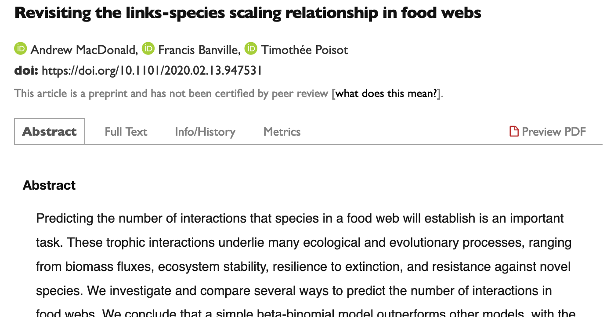
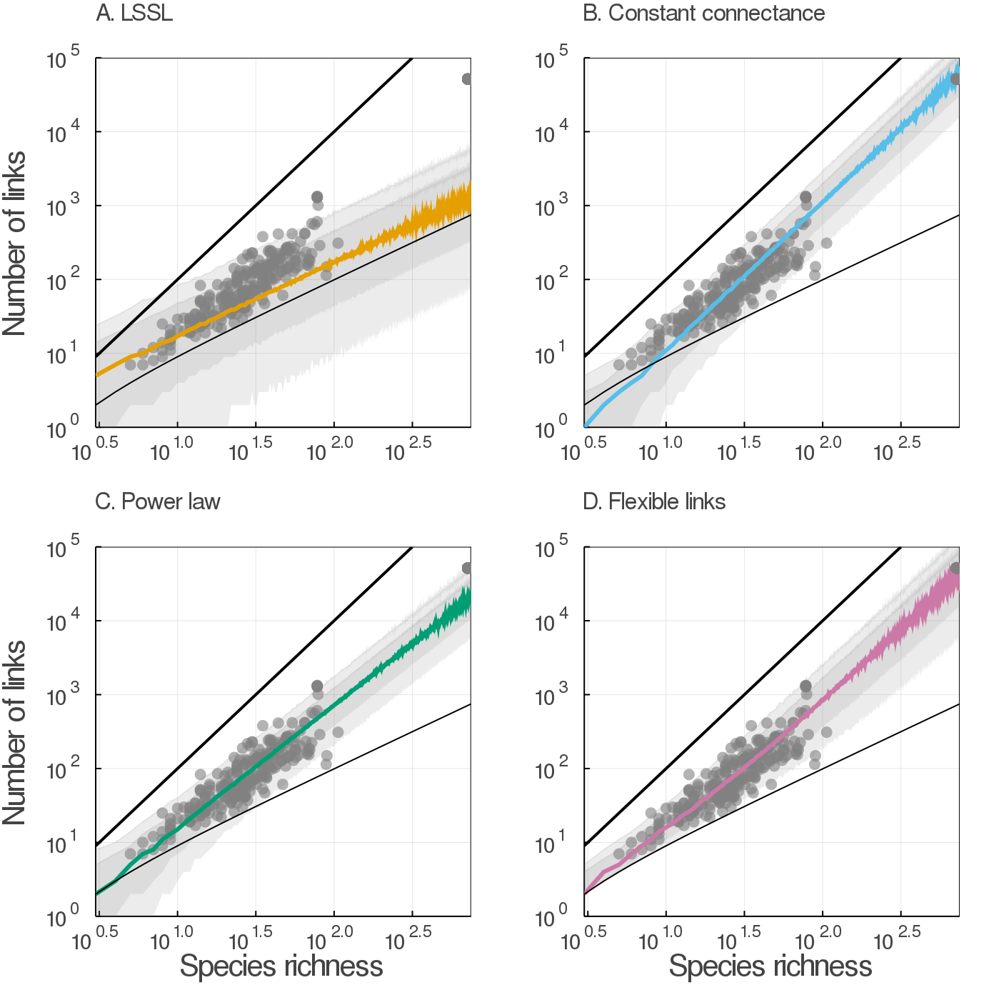

# Visualizing and understanding the posterior

There are two groups of statistics and visualizations to think about:

* How well did the model sample

* What does the model think about the world?

---

# A few common things we can calculate 
### a verbal introduction

* $y_{rep}$ => "simulated data"; observations from the model which (ideally) resemble real data
* $\hat{y}$ => Estimate of what the sample expectation should be
* $\hat{R}$ => how well did our chains mix
* $\hat{k}$ (aka Pareto k) => Predictive performance for every point. How much would posterior change without this point? 

---




.footnote[ Revisiting the links-species scaling relationship in food webs
Andrew MacDonald, Francis Banville, Timothée Poisot
bioRxiv 2020.02.13.947531; doi: https://doi.org/10.1101/2020.02.13.947531 ]


---


---

# Food webs are constrained

* If you gotta eat, you gotta eat: minimum $S-1$ links
* .. but you can't order off the menu: maximum $S^2$ links

How to make predictions within these?

.pull-left[
**Constant Connectance**
$$
L = aS^2
$$
]

.pull-right[
**"Flexible Links"**
$$
L = p * (S^2 - (S - 1)) + (S - 1)
$$

$$
p \sim \text{Beta}(\mu\phi, (1-\mu)\phi)
$$

essentially 

$$
\text{links} \sim \text{binomial}(S^2 - S + 1, p) + S - 1
$$
]

---

```stan
data{
    int W;
    int L[W];
    int S[W];
}
transformed data{
    int F[W];
    int R[W];
    int M[W];
    for ( i in 1:W ) {
        M[i] = S[i] - 1;
        F[i] = S[i] * S[i] - M[i];
        R[i] = L[i]        - M[i];
    }
}
parameters{
    real<lower=0,upper=1> mu;
    real phi;
}
model{
    phi ~ normal( 3,0.5 );
    mu ~ beta( 3 , 7 );
    for (i in 1:W){
       target += beta_binomial_lpmf(  R[i] | F[i] ,  mu * exp(phi) , (1 - mu) * exp(phi));
    }
}
```

---

```stan
generated quantities{
    vector[W] log_lik;
    vector[W] y_hat;
    for ( i in 1:W ) {
        log_lik[i] = beta_binomial_lpmf( R[i] | F[i] ,
              mu * exp(phi), (1 - mu) * exp(phi)  );
        y_hat[i] = beta_binomial_rng(
              F[i] , mu * exp(phi), (1 - mu) * exp(phi) 
              ) + M[i];
    }
}
```

---



