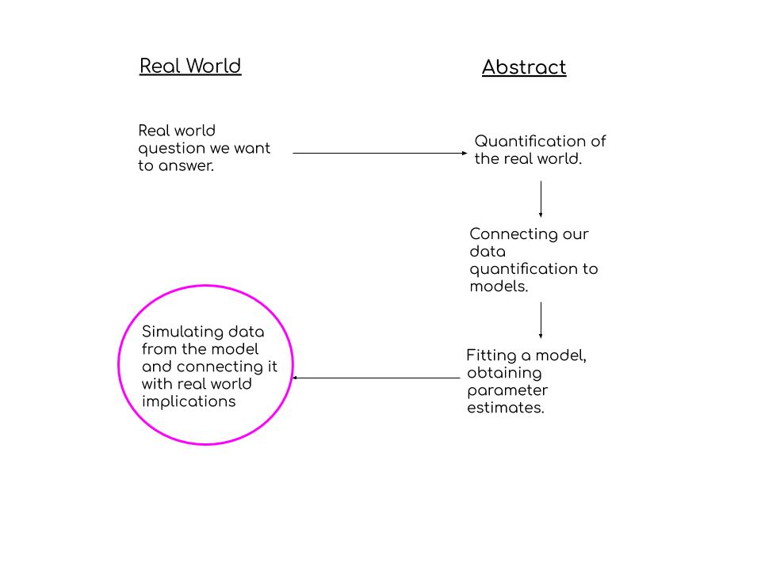
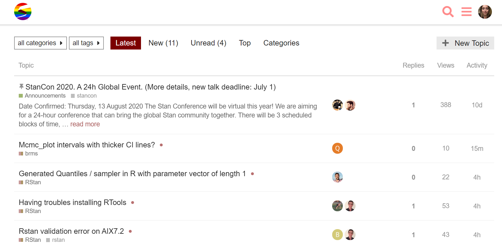

class: inverse, center, middle

```{r setup, include=FALSE}
options(htmltools.dir.version = FALSE)

library(ggplot2)

```

```{r xaringan-themer, include=FALSE, warning=FALSE}
library(xaringanthemer)
style_solarized_light()
```

# Statistical Models


---
## Model Checking: 


-- `Residuals`

-- `Prior Predictive Checks`

-- `Posterior Predictive Checks`

-- `Predictive Accuracy`


---
class: inverse, middle

# Statistical Model Assessment $\neq$ (Biologically) Useful Model 

---
class: inverse

#Biological Realism

`In what manner does my model represent biologically/ecologically important features, and where does it fail?`


---




---
### Interpreting the Statistical Results...


...by the data that your model generates. 


In particular, pretend each realization is something that actually occurred, does it make sense? Generate a population/group/system, where does your model fail? 


--

### Challenge

Make your model stand out by inserting **at least 1** structure that is specific to your system. 

--

Yes, even with a GLM. Even a linear model. 


---
class: inverse, middle

## Embrace Your Domain Expertise
**it's the most important part of the story!**


---
### Stan Help/Advice


https://discourse.mc-stan.org/


---
class: inverse, center
### Stan Ecology Community

https://stanecology.github.io


