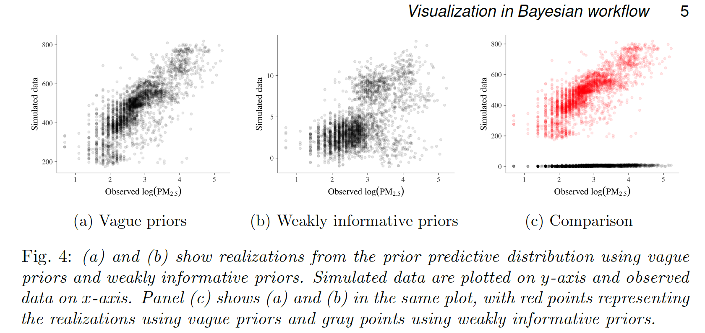
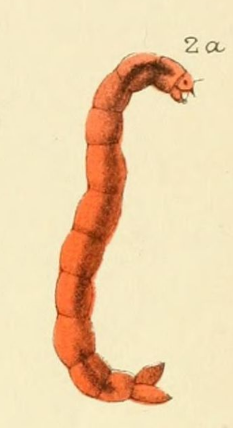
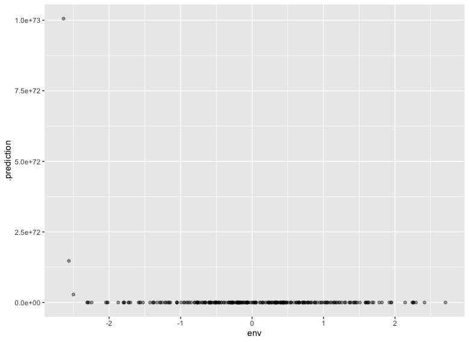
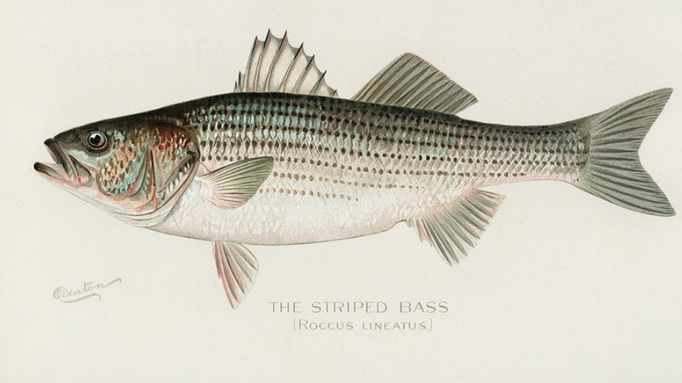

```{r setup, include=FALSE}
options(htmltools.dir.version = FALSE)
```

# Bayesian models

$$
\begin{align}
F_i & \sim \text{Poisson}(\lambda_i) \\
\text{log}(\lambda_i) &= \alpha + \beta x \\
\alpha & \sim \text{Normal}(??, ??) \\
\beta & \sim \text{Normal}(??, ??)
\end{align}
$$

---

# Bayesian models

$$
\begin{align}
F_i & \sim \text{Poisson}(\lambda_i) \\
\text{log}(\lambda_i) &= \alpha + \beta x \\
\alpha & \sim \text{Normal}(0, 1000) \\
\beta & \sim \text{Normal}(0, 1000)
\end{align}
$$

.footnote[as seen in Kéry & Royle 2016 p 188]

---
class: inverse, center, middle

# So what _is_ a good prior?

---



.footnote[
Gabry, Jonah, Daniel Simpson, Aki Vehtari, Michael Betancourt, and Andrew Gelman. « Visualization in Bayesian Workflow ». Journal of the Royal Statistical Society: Series A (Statistics in Society) 182 (2): 389‑402. https://doi.org/10.1111/rssa.12378.
]


---

# what does this prior mean?

$$
\begin{align}
F_i & \sim \text{Poisson}(\lambda_i) \\
\text{log}(\lambda_i) &= \alpha + \beta x \\
\alpha & \sim \text{Normal}(0, 1000) \\
\beta & \sim \text{Normal}(0, 1000)
\end{align}
$$

---

# what does this prior mean?

lets do an example about my favourites: fly larvae! 

.pull-left[

]

.pull-right[
$$
\begin{align}
F_i & \sim \text{Poisson}(\lambda_i) \\
\text{log}(\lambda_i) &= \alpha + \beta x \\
\alpha & \sim \text{Normal}(0, 1000) \\
\beta & \sim \text{Normal}(0, 1000)
\end{align}
$$
where $x$ is some kind of standardized environmental variable
]

---

# A quick look at the math for those curious

$$
\begin{align}
\text{log}(\lambda) &= \alpha + \beta x \\
\lambda &= e^{\alpha + \beta x} \\
\lambda &= e^{\alpha}e^{\beta x} \\
\end{align}
$$

And since $N(0,1000)$ implies that -1000 and +1000 are entirely reasonable..

.pull-left[
* $2.72^{-1000}\times 2.72^{-1000}$
* (practically zero)
]

.pull-right[
* $2.72^{1000}\times 2.72^{1000}$
* (..kind of a lot)
]

---

# either no flies at all.. or a huge planet of maggots 



for comparison, the planet Saturn weighs 5.7 * 10^29 grams

---

# syntax: brms

```r
# define formula

insects_bf <- bf(
abundance ~ 1 + env, 
family = poisson()
)
```

---

# syntax: setting priors

```r
get_prior(insects_bf, data = insect_data)

insect_priors <- c(
  prior(normal(0,100), class = "b", coef = "env"),
  prior(normal(0,100), class = "Intercept")
)
```

---

# syntax: sampling the model

```r
insect_samples <- brm(insects_bf,
                      data = insect_data,  # does nothing
                      prior = insect_priors,
                      sample_prior = "only")
```

---

# Exercise I -- Fly larvae

* see the file `insects.R` on [github](https://github.com/aammd/ISEC_stan_course/blob/996eb5b2f49c52b0290c63a6635f925104bb623b/insects.R)

* on your own or in a small group, experiment with setting priors for insect abundances.
* AND/OR consider an animal or plant which is more relevant to you 
* or stay with insects even if that is not your specialty, and set "vague" priors!

---

# exercises -- les poissons

using data from [Kaggle, about fish](https://www.kaggle.com/aungpyaeap/fish-market)

```{r message=FALSE, tidy=TRUE, results='asis'}
library(readr)
fish <- read_csv("https://raw.githubusercontent.com/aammd/ISEC_stan_course/master/Fish.csv")

knitr::kable(head(fish), format = 'html')
```

---



---


